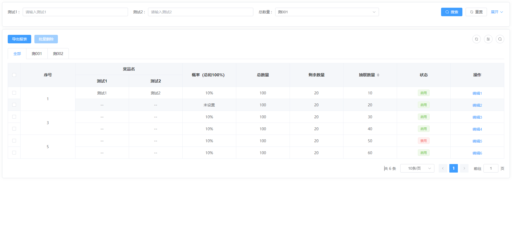

<h1 style="text-align: center">ProTable API</h1>
<div style="display: flex;color: #999;justify-content: space-around;">
  <div>作者：陈佳鑫</div>
  <div>时间：2023-07-06</div>
</div>
<br />

## 图片展示
### ProTable
<br/>


### ProModal
<br/>


## 安装依赖

```
pnpm i
```

## 打包组件 utils

```
npm run utils:build
```

## 打包 UI 组件

```
npm run ui:build
```

## 启动项目

```
npm run ui:dev
```

## 启动 vuePress

```
npm run docs:dev
```

## 使用本地项目组件库

如要使用本地项目组件库，需要将对应组件版本号改为`workspace:^`
<br/>
package.json

```
...
"dependencies": {
  "cjx-zdy-ui": "workspace:^"
}
```